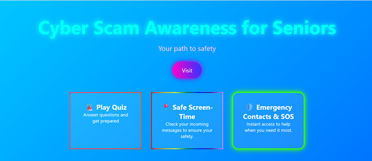

# 🛡️ Cyber-Scam-Awareness-for-Seniors

Welcome to **ScamShield**, a simple yet powerful web application designed to educate users about cyber scams, test their awareness through a quiz, and help detect suspicious messages in real-time.

---

## 🌐 Live Features

### 🔍 Scam Message Checker
Paste any message and let our system analyze it to detect potential **spam** or **scam attempts** using keyword detection and intelligent heuristics.

### ❓ Scam Awareness Quiz
Take a short quiz to test your knowledge about:
- Phishing techniques
- Common scam patterns
- Online safety best practices

### 📘 Educational Content
Browse through tips and facts about how to stay safe online and avoid falling victim to online frauds.
✨ Technologies Used

    HTML5 – Semantic page layout

    CSS3 – Responsive design and UI

    JavaScript  For quiz logic/message analysis

    ## 🖼️ Screenshots

### 🏠 Home Page

